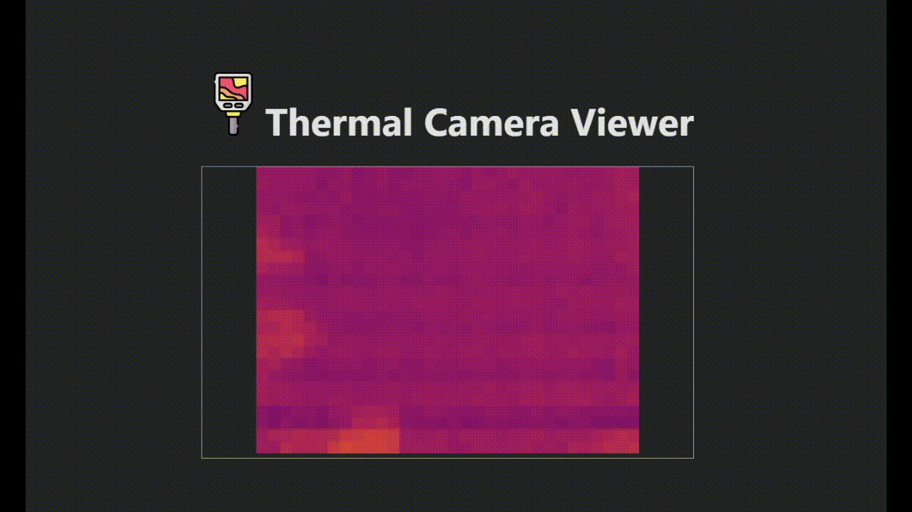

# thermal-camera-MLX90640
This repo contains drivers to interface MLX90640 infra-red array sensor in order to get current the thermal frame and configure certain parameters.

### Demo
There's a minimal [React App](thermal-camera-viewer) for receiving frame through [websocket](rust/camera-ws-stream) and for rendering the thermal frame using a **canvas**

### Drivers List
* [.NET driver](dotnet/ThermalCameraMlx90640/ThermalCameraMlx90640) (using the IoT I²C wrapper )
* [Rust driver](rust/mlx90640-hal) (can run potentially everywhere thanks to this `no_std` implementation)

### Current limitations on .Net
- refresh-rate limited to 4Hz due to inexplicable huge delay (150ms) when reading from RAM registers:
  - there must be a timing issue with the Microsoft library when querying the ram registers at high baud-rate.

## Support the project  🙏🏼 ⭐
If you’ve found this project helpful or enjoy using it, I’d be incredibly grateful for your support! Your contributions help keep the development going and ensure continued improvements. If you'd like to show your appreciation, consider making a donation:

-  paypal [link](https://paypal.me/fragrama17?country.x=IT&locale.x=it_IT)
-  BSB: 732-250, Account Number: 754415
-  IBAN: IT55 T036 4601 6005 2650

or even a star would be greatly appreciated ⭐

## Thanks
Special thanks to [Melexis](https://github.com/melexis) for providing the MLX90640 sensor documentation and [Adafruit](https://github.com/adafruit) for offering valuable templates and resources that helped inspire and guide the development of this driver.
